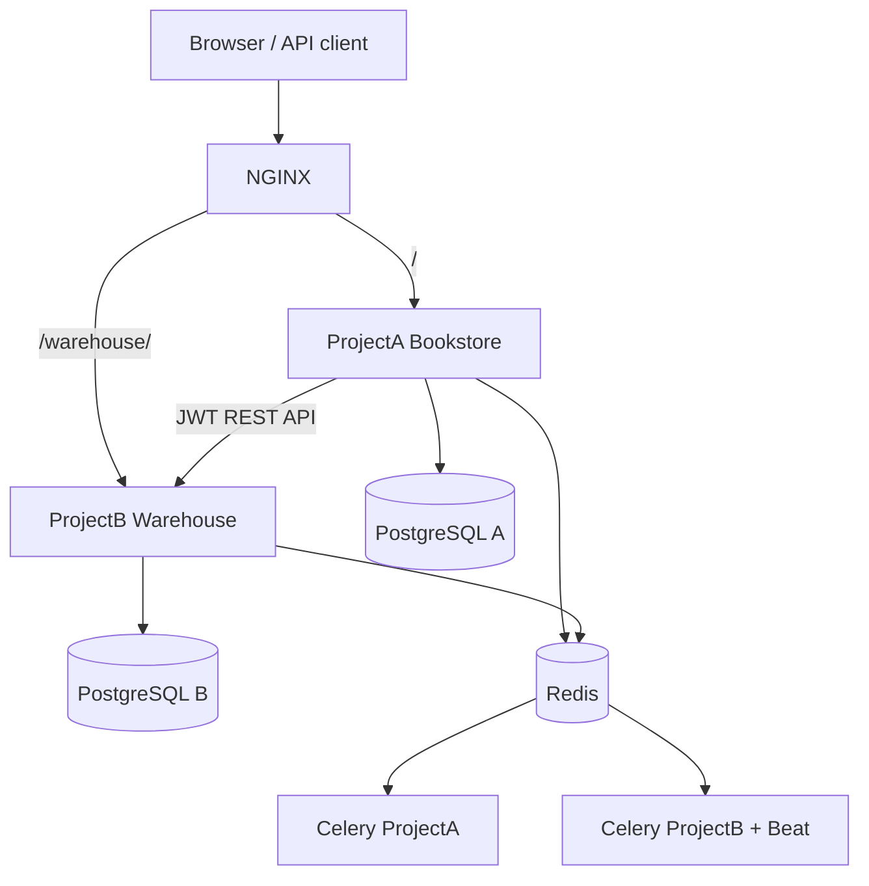

# Bookstore + Warehouse final project

Two independent Django services communicate through a REST API:

- **ProjectA (`main_app`)** — bookstore, cart, checkout, accounts and public API.
- **ProjectB (`satellite_project`)** — warehouse stock, movements and order reservations.

## Architecture



Both services use Django, DRF, PostgreSQL, Redis, Celery, Gunicorn and Sentry. NGINX is the public reverse proxy.

## Implemented requirements

- Custom user models, permissions and groups.
- Class-based API views with a shared `BaseStockView`.
- JWT access and refresh tokens.
- Celery task that expires stale reservations.
- Ukrainian and English i18n configuration.
- Redis caching of stock detail responses.
- ProjectA → ProjectB client with timeout, HTTP/JSON error handling and logging.
- Swagger/OpenAPI documentation.
- Unit, API and integration tests (Warehouse coverage: **92%**).
- Docker Compose, NGINX, Gunicorn, CI pipeline and optional Sentry configuration.

## Quick start

Requirements: Docker Desktop with Docker Compose.

```bash
cp .env.example .env
docker compose up --build
```

On Windows PowerShell:

```powershell
Copy-Item .env.example .env
docker compose up --build
```

Endpoints:

| Endpoint | Description |
|---|---|
| `http://localhost/` | Bookstore UI |
| `http://localhost/health/` | ProjectA health check |
| `http://localhost/warehouse/health/` | ProjectB health check |
| `http://localhost/warehouse/api/docs/` | Warehouse Swagger UI |
| `http://localhost/warehouse/api/schema/` | Warehouse OpenAPI schema |

Create a Warehouse administrator:

```bash
docker compose exec warehouse python manage.py createsuperuser
```

Obtain JWT:

```bash
curl -X POST http://localhost/warehouse/api/auth/token/ \
  -H "Content-Type: application/json" \
  -d '{"username":"admin","password":"your-password"}'
```

Paste the access token into Swagger **Authorize** as `Bearer <token>`.

## Warehouse API

| Method | Path | Purpose |
|---|---|---|
| GET/POST | `/warehouse/api/stocks/` | List/create stock records |
| GET/PUT/PATCH | `/warehouse/api/stocks/{book_id}/` | Stock details/update |
| POST | `/warehouse/api/stocks/{book_id}/adjust/` | Audited stock adjustment |
| GET/POST | `/warehouse/api/reservations/` | List/create reservations |
| POST | `/warehouse/api/reservations/{id}/confirm/` | Confirm and subtract stock |
| POST | `/warehouse/api/reservations/{id}/cancel/` | Release reserved stock |

Groups are created automatically after migrations:

- `Warehouse Managers`: stock and reservation management.
- `Warehouse Operators`: reservation operations.

Assign users to groups in `/warehouse/admin/`.

## Interservice communication

ProjectA contains `main_app/integrations/warehouse_client.py`. Configure:

```env
WAREHOUSE_API_URL=http://warehouse:8001/api
WAREHOUSE_SERVICE_TOKEN=<JWT access token for service user>
```

`WarehouseClient` supports stock lookup, reserve, confirm and cancel. Network timeouts, connection failures, HTTP errors and malformed JSON are logged and converted to `WarehouseError` instead of crashing ProjectA.

## Tests

Warehouse tests:

```bash
cd satellite_project
python -m venv .venv
.venv/bin/pip install -r requirements.txt
USE_REDIS=False .venv/bin/pytest
```

PowerShell:

```powershell
cd satellite_project
python -m venv .venv
.venv\Scripts\pip install -r requirements.txt
$env:USE_REDIS="False"
.venv\Scripts\pytest
```

The test command enforces coverage of at least 70% through `pytest.ini`.

## Production and Sentry

Set secure environment values on the deployment platform:

- `SECRET_KEY`, `DEBUG=False`, `ALLOWED_HOSTS`;
- PostgreSQL credentials for each service;
- `REDIS_URL`, `CELERY_BROKER_URL`, `CELERY_RESULT_BACKEND`;
- `WAREHOUSE_SERVICE_TOKEN`;
- `SENTRY_DSN` and `SENTRY_ENVIRONMENT=production`.

Deploy both databases, Redis, both web services and both workers. Run Warehouse Beat as a separate process:

```bash
celery -A warehouse beat -l info
```

The included GitHub Actions workflow runs both test suites, validates coverage and builds the Docker Compose services.
